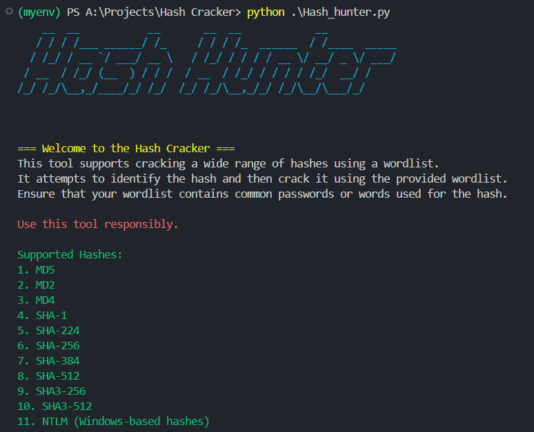

# Hash Hunter



## Description
- Hash Cracker is a Python-based tool designed to crack hashed passwords using a wordlist. 
- Supports various hashing algorithms 
- This tool is intended for educational purposes and should only be used in compliance with legal and ethical guidelines.

## Features
- Supports cracking of MD5 and NTLM hashes.
- Uses a customizable wordlist for password guessing.
- Provides clear output indicating whether a hash has been cracked.

## Requirements
To run this project, you'll need the following Python libraries:
- `passlib`
- `termcolor`
- `pyfiglet`

You can install these dependencies by running:

```bash
pip install -r requirements.txt
```

## Installation
Clone the repository
```bash
git clone https://github.com/Cyberpunk010/Hash-Hunter-Project.git
cd hash-cracker
```
Install the required packages:

```bash
pip install -r requirements.txt
```

## Usage
To crack a hash, run the following command:

```bash
python hash_cracker.py 
```


